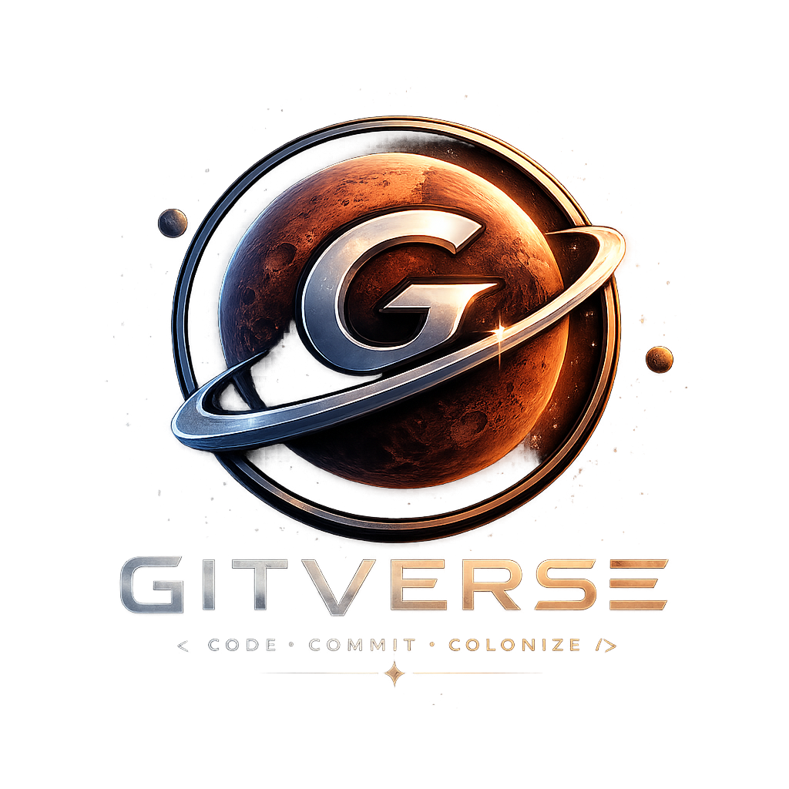
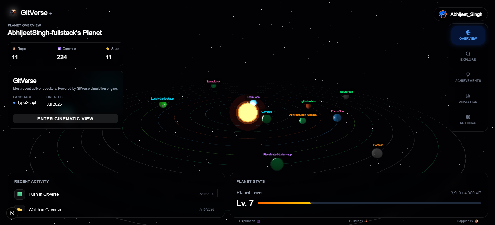
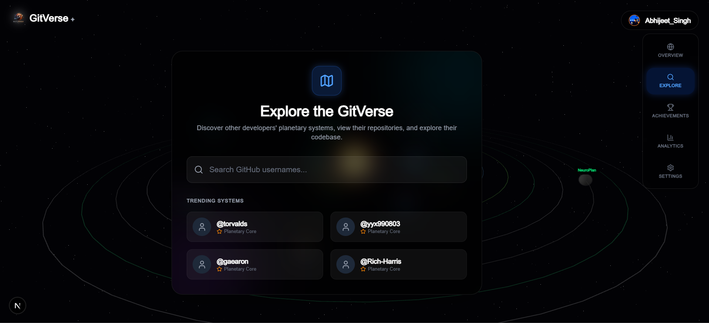
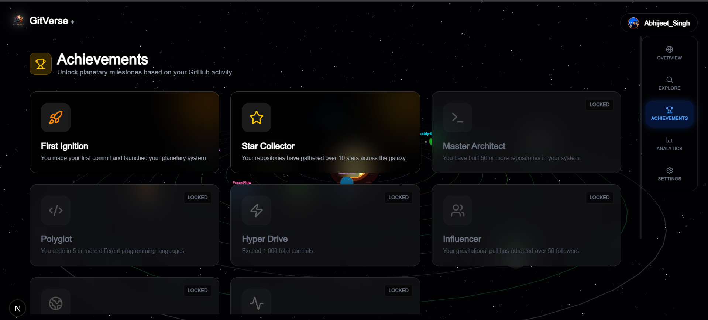
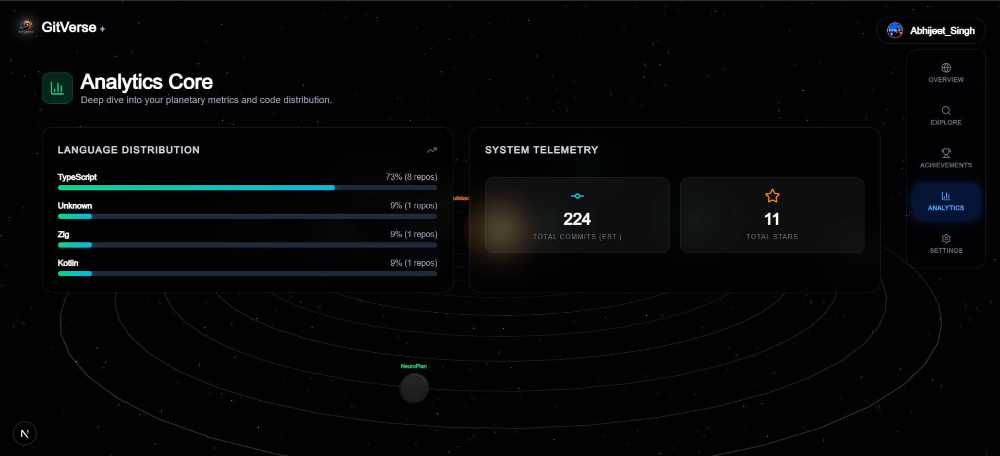
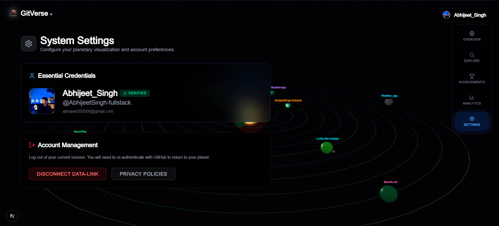

# 🌌 GitVerse



> **Transform your GitHub history into a thriving, living 3D planetary system.**

GitVerse is a next-generation data visualization platform that turns your daily GitHub commits, repositories, and stars into an interactive, gamified 3D universe. Explore your codebase like never before, unlock achievements, and travel to other developers' galaxies.

---

## ✨ Features

### 🪐 3D Planetary Overview
Your repositories are no longer just lists—they are planets orbiting your central star. 
- **Planet Size**: Represents the number of commits and overall activity.
- **Planet Color & Biome**: Determined by the primary programming language of the repository.
- **Cinematic View**: Dive down to the surface of your repositories and explore your code cities in real-time 3D.


*A visual representation of your GitHub ecosystem.*

### 🚀 Explore the Galaxy
Don't just stay in your own solar system. Use the **Explore** feature to search for any GitHub user and warp to their galaxy. Check out trending systems from legendary developers like `@torvalds` or `@yyx990803`.


*Warp to other developers' systems seamlessly.*

### 🏆 Gamified Achievements
Your GitHub activity unlocks unique planetary milestones. From making your first commit to collecting over 500 stars across your galaxy, track your progress and level up your developer status.


*Unlock milestones based on your coding journey.*

### 📊 Analytics Core
Deep dive into your planetary metrics. View detailed telemetry including your total commits, total stars, and a breakdown of your repository language distribution.


*Understand your code distribution at a glance.*

### ⚙️ System Settings
Manage your essential credentials, verify your GitHub data-link, and configure your planetary visualization preferences all from a sleek, glassmorphism UI.


*Secure and intuitive account management.*

---

## 🛠️ Tech Stack

- **Framework**: [Next.js](https://nextjs.org/) (App Router)
- **3D Rendering**: [Three.js](https://threejs.org/) & [React Three Fiber](https://docs.pmnd.rs/react-three-fiber/)
- **Styling**: [Tailwind CSS](https://tailwindcss.com/)
- **Icons**: [Lucide React](https://lucide.dev/)
- **Authentication**: [Supabase](https://supabase.com/) & GitHub OAuth

---

## 🚀 Getting Started

### Prerequisites
Make sure you have Node.js installed on your machine.

### Installation

1. **Clone the repository**
   ```bash
   git clone https://github.com/your-username/GitVerse.git
   cd GitVerse
   ```

2. **Install dependencies**
   ```bash
   npm install
   ```

3. **Set up Environment Variables**
   Create a `.env.local` file in the root of the project and add your Supabase and GitHub credentials:
   ```env
   NEXT_PUBLIC_SUPABASE_URL=your_supabase_url
   NEXT_PUBLIC_SUPABASE_ANON_KEY=your_supabase_anon_key
   ```

4. **Run the Development Server**
   ```bash
   npm run dev
   ```

5. **Explore your Universe**
   Open [http://localhost:3000](http://localhost:3000) in your browser, log in with GitHub, and watch your universe come to life!

---

## 🤝 Contributing
Contributions, issues, and feature requests are welcome! Feel free to check the [issues page](https://github.com/your-username/GitVerse/issues).

## 📝 License
This project is [MIT](https://choosealicense.com/licenses/mit/) licensed.

---

## 📬 Contact
For any inquiries or feedback, please reach out to: **abhijeet200508@gmail.com**
